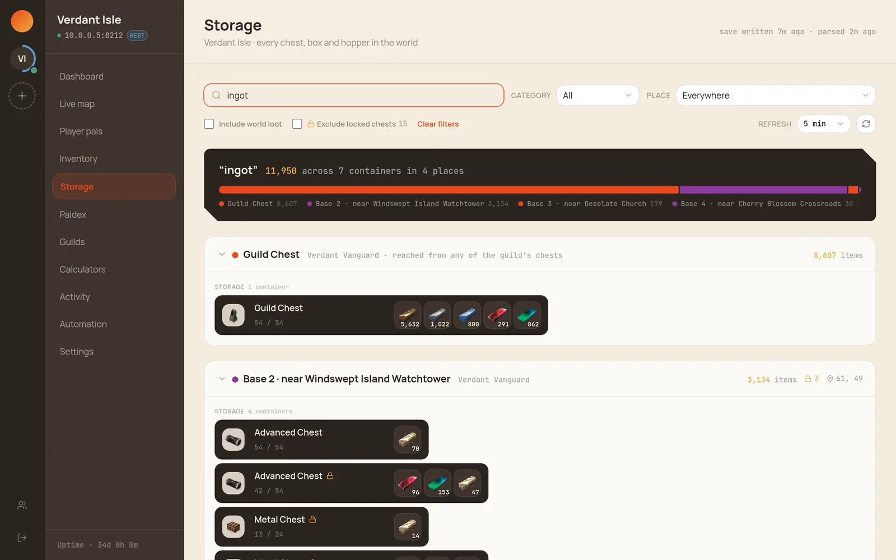

<div align="center">


# Palcon

**The dashboard your Palworld server deserves.**

Self-hosted management for Palworld dedicated servers — live map, player pals,
breeding math, backups and one-click repair.
One Go binary. Your hardware. Your data.

[](https://github.com/safwyls/palcon/actions/workflows/docker.yml)
[](https://github.com/safwyls/palcon/actions/workflows/pages.yml)

[**Live demo**](https://safwyls.github.io/palcon/demo/) ·
[**Homepage**](https://safwyls.github.io/palcon/) ·
[**Documentation**](https://safwyls.github.io/palcon/docs/) ·
[Wiki](https://github.com/safwyls/palcon/wiki) ·
[Issues](https://github.com/safwyls/palcon/issues) ·
[Ko-fi](https://ko-fi.com/safwyl)

</div>


## What it does


- **Watch** — live dashboard and performance charts, a world map with guild
  bases and point-of-interest layers, every player's pals with IVs and
  passives straight from the save file, their bags laid out slot by slot the
  way the game draws them, paldex completion and server records, and a
  playtime activity board.
- **Manage** — start/stop/restart, a `PalWorldSettings.ini` editor, SteamCMD
  repair and updates with a live transcript, scheduled save backups, and
  per-user permissions with an admin audit trail, and per-server visibility
  switches so a view — or one player's pals, bags or position — can be kept
  private, including whether password-locked chests are searchable at all.
- **Automate** — scheduled restarts with in-game warnings, a crash watchdog,
  Discord notifications, and an opt-in public status page.
- **Find** — search every container in the world at once. One search answers
  how much of something the server holds, which bases it's spread across, and
  which chest to open — named and pictured the way the game does it, so
  "Refined Metal Chest" sends you to the right box. Guild chests included;
  the map's treasure chests too, behind a spoiler prompt, so nobody gets
  handed a loot map they didn't ask for.
- **Plan** — breeding calculators that know what's actually in your boxes:
  child species, reverse lookup, shortest routes, passive-inheritance odds.

The whole console is responsive and installable as a PWA, so it works as well
from a phone as from a desk.

<br clear="right"/>

| Player pals | Inventory |
|---|---|
|  |  |

| Paldex & records | Breeding calculators |
|---|---|
|  |  |

| Storage search |
|---|
|  |

## Quick start

```sh
docker run -p 8080:8080 \
  -v $(pwd)/data:/data \
  -e JWT_SECRET=... -e ENCRYPTION_KEY=<32 chars> -e ADMIN_PASSWORD=... \
  ghcr.io/safwyls/palcon:latest
```

Then open `http://localhost:8080`, sign in, and add your server. The docs
cover the real-world setups:

- [Deploy on TrueNAS Scale](https://safwyls.github.io/palcon/docs/deploy-truenas.html) — the reference setup
- [Deploy with Docker](https://safwyls.github.io/palcon/docs/deploy-docker.html) — any Linux box
- [First login & your first server](https://safwyls.github.io/palcon/docs/first-server.html)
- [Troubleshooting](https://safwyls.github.io/palcon/docs/troubleshooting.html)

## Under the hood

Palcon talks to the game over its REST API with automatic RCON fallback, and
reads the world save directly for everything no admin command exposes. Three
rules the design never breaks:

- **Saves are read-only, structurally.** Read-only mounts and a
  decompress-only unwrapper — there is no code path that writes a save.
- **No Docker socket.** Power control goes through a
  [scoped proxy](https://safwyls.github.io/palcon/docs/power-control.html);
  the worst case is a bounced game server.
- **Your data stays home.** One SQLite file, credentials encrypted at rest,
  no outbound calls except a Discord webhook you configure.

An optional per-server agent, [`palagent`](https://safwyls.github.io/palcon/docs/palagent.html),
replaces the bind mounts entirely — and in supervisor mode runs the game
itself, enabling remote hosts and one-click server provisioning. Full design
in [`docs/sidecar-agent.md`](docs/sidecar-agent.md).

## Development

Requires Go 1.22+, Node 24+, and Python 3 with `palworld-save-tools` + `pyooz`
for the save-reading features.

```sh
cp .env.example .env && export $(cat .env | xargs)
go run ./cmd/palcon        # backend on :8080
cd web && npm install && npm run dev   # frontend with hot reload
go test ./...              # backend tests
cd web && npm test         # frontend tests (vitest; also test:watch, test:coverage)
```

Go coverage is measured with `go test ./... -coverpkg=./...` — the flag counts
code exercised by another package's tests, so plain per-package numbers read
lower than the real figure.

For a production-style single-binary run, `npm run build` in `web/` first so
the Go binary embeds the fresh bundle. `docs/go-notes.md` is a Go reference
written against this codebase.

<details>
<summary>Repo layout</summary>

```
cmd/palcon/           dashboard entrypoint
cmd/palagent/         sidecar agent entrypoint (companion/supervisor/provisioner)

  game-agnostic core — none of this knows what Palworld is
internal/game/        the contracts: Client, Metrics, Definition + registry
internal/api/         HTTP handlers, auth, permissions, routing
internal/agentctl/    palcon's client for palagent sidecars
internal/agentfiles/  agent-synced save/config cache
internal/backup/      save snapshot schedule + archives
internal/collector/   background metrics + save-refresh sampling
internal/config/      env-based config
internal/crypto/      AES-GCM encryption for stored passwords
internal/db/          sqlite connection + migrations
internal/dockerctl/   docker API client (scoped proxy; create for the provisioner)
internal/notify/      Discord webhooks
internal/rcon/        Source RCON wire protocol (+ rcontest, a fake server)
internal/savecache/   mtime-keyed world-save parse cache
internal/sched/       scheduled restarts
internal/steamcmd/    SteamCMD cache clear + update args
internal/store/       data access: servers, users, metrics
internal/watchdog/    crash watchdog for docker-managed servers

  per-game implementations
internal/games/                        the registry's import list
internal/games/palworld/               REST + RCON clients, fallback, uids
internal/games/palworld/palsave/       save reading (Python extractor + Go runner)
internal/games/palworld/palconfig/     PalWorldSettings.ini parsing + editing
internal/palagent/    the sidecar agent itself (all three modes)

web/                  React frontend, embedded into the Go binary
site/                 homepage + docs, published to GitHub Pages
```

Adding a second game means implementing `game.Client` and registering a
`game.Definition` — see [docs/porting-to-another-game.md](docs/porting-to-another-game.md).

</details>

## Credits & disclaimer

Palcon is an unofficial fan project, not affiliated with or endorsed by
Pocketpair. Palworld, pal artwork and map imagery are © Pocketpair, Inc.,
credited on-screen wherever they appear
([details](docs/vendored-game-data.md)). Save parsing builds on
[palworld-save-tools](https://github.com/cheahjs/palworld-save-tools) and
[pyooz](https://pypi.org/project/pyooz/).

If Palcon makes tending your world easier, a ⭐ helps other server admins
find it — and a [coffee](https://ko-fi.com/safwyl) keeps the maintainer
breeding Anubis at 2 a.m.
