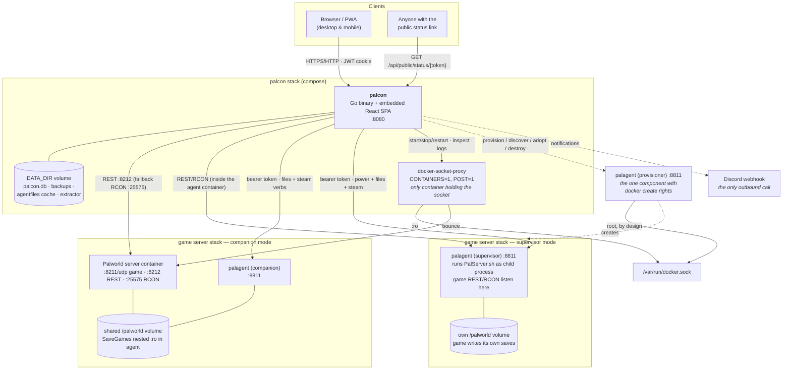
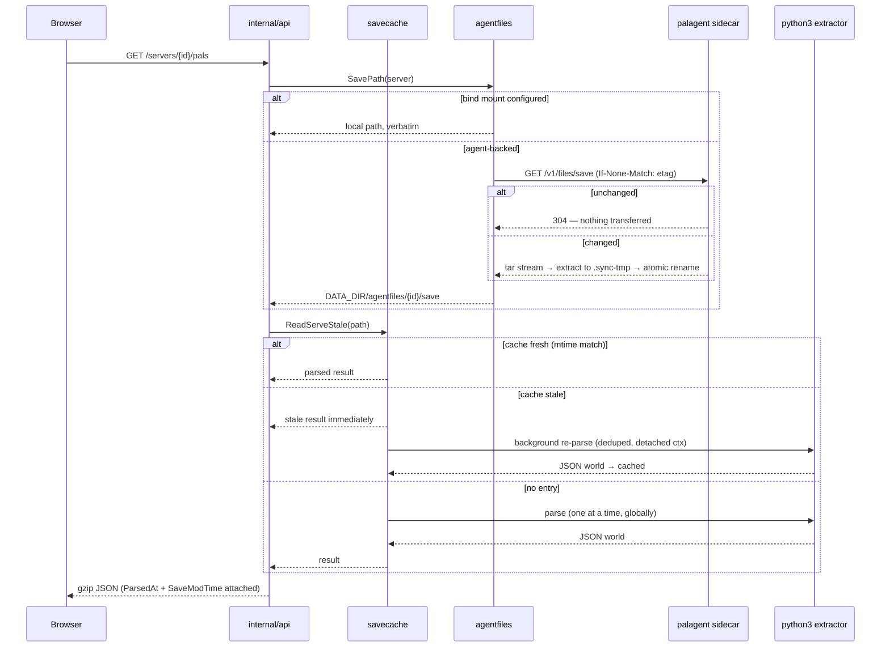
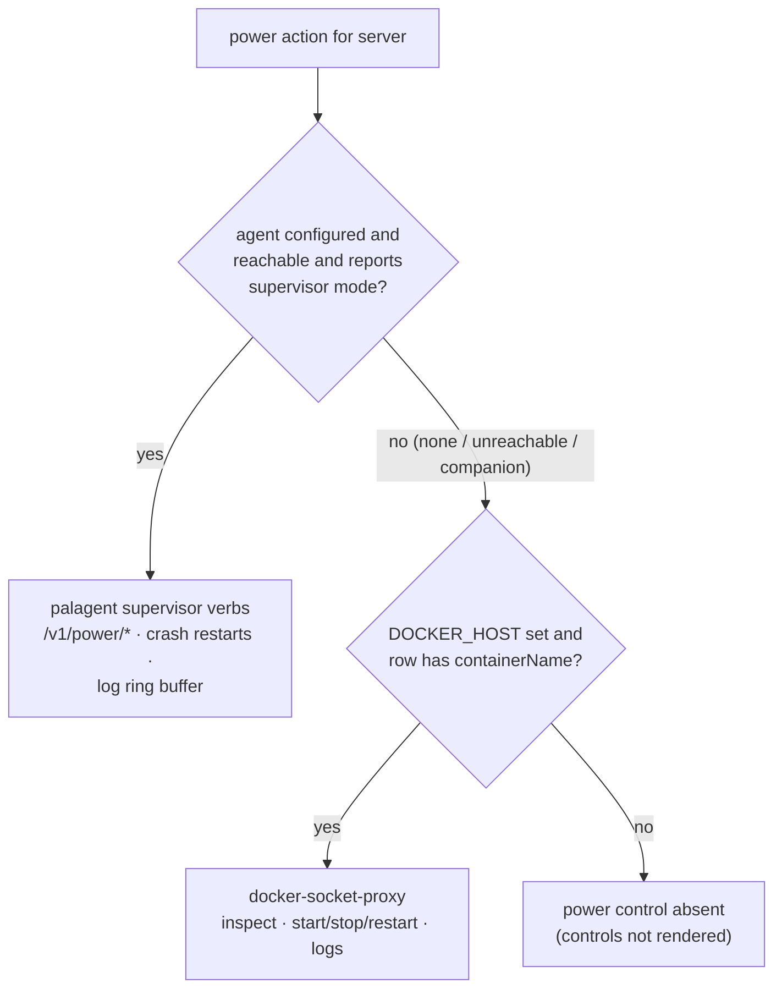
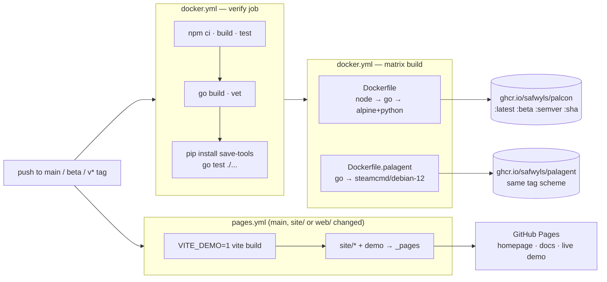

# Palcon architecture

This is the map of the system: what the pieces are, how they talk to each
other, and where the boundaries are drawn. It cross-references the deeper
docs where they exist — [`sidecar-agent.md`](sidecar-agent.md) for the agent
design, [`porting-to-another-game.md`](porting-to-another-game.md) for the
game abstraction's edges, [`visibility.md`](visibility.md) for the privacy
model, [`vendored-game-data.md`](vendored-game-data.md) for the shipped
catalogs.

In one sentence: **palcon is a single Go binary acting as a pure control
plane** — it holds no docker socket, never writes a game save, and reaches
game servers only over their own admin interfaces (REST/RCON), a scoped
docker proxy, or an optional per-server sidecar agent — serving an embedded
React SPA that polls a JSON API.

## Contents

- [Tech stack](#tech-stack)
- [System context & deployment](#system-context--deployment)
- [Backend component architecture](#backend-component-architecture)
- [Startup wiring & background loops](#startup-wiring--background-loops)
- [The game abstraction](#the-game-abstraction)
- [API layer: auth & permissions](#api-layer-auth--permissions)
- [Data layer](#data-layer)
- [The save-reading pipeline](#the-save-reading-pipeline)
- [Power control & the stop sequence](#power-control--the-stop-sequence)
- [palagent: the sidecar](#palagent-the-sidecar)
- [Frontend](#frontend)
- [Build, CI & publishing](#build-ci--publishing)
- [Cross-cutting design rules](#cross-cutting-design-rules)

## Tech stack

| Layer | Choice | Why |
|---|---|---|
| Backend | Go 1.26, one module, **two binaries** (`cmd/palcon`, `cmd/palagent`) | Single static binary per role; shared internal packages so file operations behave identically whichever side executes them |
| HTTP router | chi v5 | Small, stdlib-shaped |
| Auth | golang-jwt v5 (HS256, pinned), bcrypt via `x/crypto` | JWT in an HttpOnly cookie; no server-side session table |
| Database | SQLite via `modernc.org/sqlite` (pure Go) | No cgo → `CGO_ENABLED=0` builds and an alpine runtime with no glibc; one file in `DATA_DIR` |
| Secrets at rest | AES-256-GCM (`internal/crypto`) | RCON/REST passwords and agent tokens encrypted in the DB |
| Save parsing | Embedded Python (`palworld-save-tools` + `pyooz`), invoked as a subprocess | The community GVAS parser is the standard; deliberately not reimplemented in Go. `pyooz` is decompress-only — it structurally cannot write a save |
| Frontend | React 18 + TypeScript 5.5, Vite 5 | SPA embedded into the Go binary via `go:embed` |
| Server state | TanStack Query v5 — the only state manager | REST + polling everywhere; no websockets, no SSE, no Redux |
| Styling | Tailwind 3.4 + shadcn-style components over Radix primitives | One Palworld-branded light theme; installable PWA (manifest-only, no service worker) |
| Game transports | Palworld REST (HTTP Basic) with Source RCON fallback (`internal/rcon`) | REST preferred where enabled; RCON covers the rest |
| Container control | Docker Engine HTTP API via `tecnativa/docker-socket-proxy` | Palcon never holds the socket; the proxy allows exactly inspect + start/stop/restart |
| Images | `ghcr.io/safwyls/palcon` (alpine) and `ghcr.io/safwyls/palagent` (steamcmd/debian) | Two images, one repo, same tag scheme |
| Site & demo | Static `site/` + the real frontend built with `VITE_DEMO=1`, on GitHub Pages | The demo answers every API call from a bundled fixture |

Go direct dependencies number five: chi, golang-jwt, `x/crypto`, and
modernc.org/sqlite (plus its transitive tooling). Everything else is stdlib.

## System context & deployment

The reference deployment is compose stacks on one Docker host (TrueNAS Scale
being the documented case), but each game server's stack can equally live on
a **different host** — that is what the agent exists for. The structural
rule from `sidecar-agent.md`: palcon's stack and each game server's stack
are separate compose files joined by a shared external network, so
`docker compose down` on palcon can never take a game server with it.

Reading the trust gradient left to right: the browser gets a cookie; palcon
gets fixed verbs on the proxy and on each agent; only the proxy and the
optional provisioner ever touch the docker socket, and the proxy holds it
read-only with two API classes enabled. A fully compromised palcon can
bounce game servers and touch agent-scoped files — it cannot create
containers, mount volumes, or reach host root. The provisioner is the
documented, deliberate exception ([`sidecar-agent.md`](sidecar-agent.md)
covers the risk model; it degrades to a copy-paste flow when absent).

Bind mounts remain a fully supported degraded mode for same-host setups:
save directory mounted read-only, config directory mounted read-write as a
deliberately separate mount, no agent involved.

## Backend component architecture

The repo is split into a **game-agnostic core** — none of it knows what
Palworld is — and **per-game implementations** that plug in through a
registry. The moderation, power, metrics, scheduling and watchdog paths are
written purely against the `internal/game` contracts.

```mermaid
flowchart TB
    subgraph entry["entrypoints"]
        cmdpalcon["cmd/palcon"]
        cmdpalagent["cmd/palagent"]
    end

    subgraph core["game-agnostic core"]
        api["internal/api<br/>HTTP handlers · auth · permissions · routing"]
        gamepkg["internal/game<br/>Client · ExtendedClient · Definition · registry"]
        store["internal/store<br/>servers · users · metrics · row→client bridge"]
        db["internal/db<br/>sqlite + embedded migrations"]
        crypto["internal/crypto<br/>AES-GCM box"]
        collector["internal/collector<br/>metrics sampling · save refresher"]
        sched["internal/sched<br/>scheduled restarts"]
        watchdog["internal/watchdog<br/>crash revival"]
        backup["internal/backup<br/>save snapshots"]
        notify["internal/notify<br/>Discord webhooks"]
        dockerctl["internal/dockerctl<br/>docker API client (proxy-shaped)"]
        agentctl["internal/agentctl<br/>palagent client"]
        agentfiles["internal/agentfiles<br/>save/config path resolver + sync cache"]
        savecache["internal/savecache<br/>mtime-keyed parse cache"]
        rcon["internal/rcon<br/>Source RCON wire protocol"]
        steamcmd["internal/steamcmd<br/>cache clear + update args"]
        config["internal/config"]
    end

    subgraph pergame["per-game implementations"]
        games["internal/games<br/>registry import list"]
        palworld["internal/games/palworld<br/>REST + RCON clients · fallback · uid canon"]
        palsave["…/palworld/palsave<br/>save reading (Python extractor + Go runner)"]
        palconfig["…/palworld/palconfig<br/>PalWorldSettings.ini parse + edit"]
    end

    palagent["internal/palagent<br/>companion · supervisor · provisioner"]
    web["web/ (React SPA)<br/>embedded via go:embed"]

    cmdpalcon --> api & collector & sched & watchdog & backup
    cmdpalagent --> palagent
    api --> store & savecache & dockerctl & agentctl & agentfiles & notify
    api -.->|"save/config views<br/>(still Palworld-shaped)"| palsave & palconfig
    store --> db & crypto & gamepkg
    collector & sched & watchdog --> store
    palworld -->|"game.Register()"| gamepkg
    games -.->|blank import| palworld
    palworld --> rcon
    palagent --> steamcmd & palconfig & dockerctl
    agentfiles --> agentctl
    savecache --> palsave
    web -.->|"embedded into"| cmdpalcon
```

Two honesty notes the code itself makes: the save/config views in
`internal/api` still import `games/palworld` directly (the abstraction is
the *goal*, tracked in `porting-to-another-game.md`, not a finished fact),
and `store/gameclient.go` is deliberately the **one** place a server row
becomes a live `game.Client` — the API handlers, collector and scheduler
previously each did it themselves and drifted.

## Startup wiring & background loops

`cmd/palcon/main.go` is the entire composition root — a flat sequence, no
DI framework: load env config → open SQLite (single connection, inline
migrations) → build the AES-GCM box and the store around it → bootstrap the
admin user (first run only) → materialize the embedded Python extractor
into `DATA_DIR` → start the background loops → serve HTTP.

Every loop is ticker-driven and stateless against the DB: each tick
re-reads the server rows, so a UI edit takes effect on the next tick with
no signalling channel between the API and the loops.

| Loop | Package | Tick | What it does |
|---|---|---|---|
| Collector | `internal/collector` | 30s sample / 1h prune | Fans out per server (10s per-server timeout): health sample for the charts, player join/leave sessions, reachability-change notifications. Prunes metrics (7d), player events (90d), audit (365d) |
| Save refresher | `internal/collector` | 15s poll, 45s per-server parse floor | Keeps the save-parse cache warm across autosaves; for agent-backed servers this same loop drives the file sync. Sequential on purpose — each parse holds a decompressed world in memory |
| Scheduler | `internal/sched` | 20s | Scheduled restarts with in-game warnings; a 2-minute stale window so a missed slot isn't replayed after the host wakes from sleep |
| Watchdog | `internal/watchdog` | 30s | Revives watched containers after an unclean exit; 5min cooldown, 3 strikes, strikes clear after 10min healthy. Only runs when docker control is configured |
| Backup | `internal/backup` | 60s | Zip snapshots of the save directory into `DATA_DIR`, per-server interval and retention |

Optionality is wiring, not error handling: without `DOCKER_HOST` the
`dockerctl` client is `nil` and power control is *absent*; without
`PROVISIONER_URL` the one-click wizard degrades to handing you a stack file.
The same nil-means-off pattern recurs at every optional edge.

Shutdown: `signal.NotifyContext` cancels one context shared by every loop;
the HTTP server gets 10 seconds; the collector alone is *awaited*, because
it closes out the play sessions of whoever is still online — exiting
without waiting would strand joins that forever read as sessions that never
ended.

## The game abstraction

`internal/game` defines the contract as the **intersection** of what
Source-derived dedicated servers offer, because that intersection is
stable: announce, kick, ban, unban, save, shut down, list players, report
identity.

- **`game.Client`** — 8 methods: `Info`, `Players`, `Broadcast`, `Kick`,
  `Ban`, `Unban`, `Save`, `Shutdown`.
- **`game.ExtendedClient`** — `Settings` and `Metrics`, which plain RCON
  cannot serve. Callers type-assert and **degrade rather than fail**; the
  collector silently skips metrics for RCON-only servers.
- **`game.Definition`** — what the registry stores per game: `ID`, `Name`,
  `DefaultGamePort`, `NewClient(Conn) Client`, `CanonicalUID(string) string`,
  and `Features` — the dashboard views this game can fill.
- **Registry** — package-level map; implementations `Register` from `init`,
  and `internal/games` blank-imports every one so `cmd/palcon` wires them
  all with a single side-effect import. Duplicate or malformed
  registrations panic at startup rather than surfacing later as an
  unreachable server.

Feature keys (`map`, `pals`, `inventory`, `storage`, `paldex`,
`achievements`, `guilds`, `calculators`) deliberately name *dashboard
views*, not game concepts — a hypothetical ARK port reuses `pals` for
tames and `paldex` for the dino dex rather than inventing synonyms. They
double as the admin's per-server visibility switches.

The Palworld implementation supplies three transport pieces:

- **`RESTClient`** — the game's HTTP admin API, Basic auth, 5s timeout
  (kept short *because* the fallback sits behind it).
- **`RCONClient`** — Palworld's command vocabulary over the generic Source
  RCON transport in `internal/rcon` (which ships `rcontest`, a fake server,
  for tests).
- **`fallbackClient`** — the subtle part. It falls back to RCON only on
  *transport-level* failure (connection refused, timeout — i.e. the REST
  API is disabled). An HTTP-status error proves REST is up, so a wrong
  REST password surfaces as a REST auth error instead of being masked by
  an RCON retry. When both fail, both causes are reported.

`CanonicalUID` normalizes the three spellings of a player id (REST's
undashed hex, RCON's decimal integer, the save file's dashed guid) into
the save-file form. Getting this wrong fails silently — a mismatched id
never matches, which for a visibility check means failing open — hence it
lives on the Definition rather than being each caller's problem.

## API layer: auth & permissions

Router: chi, one `Routes(staticFS)` builder. Middleware stack: request id,
real IP, logging, panic recovery, compression (the pals payload is tens of
MB and compresses ~10×); under `/api`, a 1 MiB body cap and JSON 404s. The
router's `NotFound` is the SPA handler: try the embedded file, else serve
`index.html` so client-side deep links survive refresh.

**Auth** is a JWT in an HttpOnly cookie (`palcon_session`, 7 days,
`SameSite=Lax`, `Secure` behind `COOKIE_SECURE`), HS256 with the algorithm
pinned server-side. Claims carry the **user id, not the username**, so
renames don't invalidate sessions — and `requireAuth` re-reads the user
from the DB on every request rather than trusting week-old claims, so
disabling an account or revoking a permission takes effect immediately.
Login is rate-limited on both IP and username keys.

**Permissions** are a flat string set per user: `power`, `broadcast`,
`save`, `moderate`, `shutdown`, `settings`. Admins pass everything, so
repairing a broken grant never depends on the grants. Deliberate choices:

- **Viewing is not a permission.** Any signed-in user reads dashboards,
  map and save-derived data; per-server *visibility switches* (admin-set)
  are the privacy control, not per-user grants. See
  [`visibility.md`](visibility.md).
- `shutdown` is split from `power` so someone can bounce a container
  without being allowed to boot everyone mid-session.
- `settings` gates *reading* the config too — `PalWorldSettings.ini`
  holds passwords in the clear.
- Backups are admin-only in both directions; the archive is the whole
  world.

The only unauthenticated data endpoint is `GET /api/public/status/{token}`
— token-gated, read-only, and served entirely from palcon's own DB so
public traffic can never probe or load the game server.

**There are no websockets and no SSE anywhere.** Every live view is REST
plus client-side polling; even container logs are a bounded GET the viewer
polls, rather than a held-open stream through the proxy.

## Data layer

One SQLite file at `DATA_DIR/palcon.db`, opened with a **single
connection** (`SetMaxOpenConns(1)`) to sidestep concurrent-write locking,
foreign keys on. Migrations are embedded `.sql` files applied in lexical
order, each in its own transaction, tracked in `schema_migrations` — no
external tool, no down migrations.

The `servers` table is the wide central row; around it sit `users`,
`restart_schedules`, `discord_webhooks`, `player_events`,
`player_sessions`, `server_metrics`, `server_watch`, `audit_log`,
`player_visibility`, and friends.

Two rules the store enforces:

- **Secrets never leave it decrypted-by-accident.** RCON/REST passwords
  and agent tokens are AES-GCM blobs; the API serializes `hasRconPassword`
  booleans, never values. The encryption box is constructed once in
  `main` and lives inside the store.
- **The edit form can't clobber what it doesn't carry.** Watchdog state,
  the public-status token, and backup settings each have their own setter
  outside `UpdateServer`, so saving the server form can never silently
  switch the watchdog off.

## The save-reading pipeline

Everything the game's admin APIs don't expose — pals, IVs, inventories,
storage, guilds, paldex, records — comes from parsing `Level.sav`
directly. The pipeline is layered so that the expensive part almost never
blocks a request:

The pieces:

- **`palsave`** owns only Palworld's schema and the extractor: two
  embedded Python scripts materialized into `DATA_DIR` at startup and run
  as `python3 extract_pals.py <Level.sav>` with JSON on stdout. Runtime
  dependencies (`palworld-save-tools`, `pyooz`) live in the Docker image.
  Everything is read-only by construction — the published `pyooz` wheel is
  decompress-only and cannot write a save.
- **`savecache`** is game-agnostic: mtime-keyed entries, a global
  one-parse-at-a-time lock (each parse holds a whole decompressed world),
  double-checked after lock acquisition so queued requests reuse the
  winner's result, an 8-entry bound evicting the stalest, and a 3s
  write-settle so a file mid-autosave is never parsed. `ReadServeStale` —
  what every human-facing handler uses — returns stale data instantly and
  refreshes in the background, so the pals pages never wait on a
  multi-second parse.
- **The save refresher loop** keeps the cache warm between requests, and
  for agent-backed servers is also what drives the file sync.
- **`agentfiles`** is the seam that keeps the rest of the system agnostic:
  the parser, backup archiver and ini editor work on local paths and never
  learn agents exist. On a sync failure with a cached copy present it
  serves the cache with a warning — a briefly-down agent shouldn't blank
  the pals pages.

## Power control & the stop sequence

Power (start/stop/restart, status, logs) resolves per server, in
precedence order — and the resolution lives in exactly one function
(`agentctl.Supervisor`) because three callers (power handlers, scheduler,
SteamCMD gate) ask the question and must get the same answer:

The stop sequence is the same in both modes and is deliberately
choreographed — Palworld's container images swallow SIGTERM, so a bare
`docker stop` ends in SIGKILL and an exit code that Docker, TrueNAS and
the watchdog all read (accurately) as a crash:

1. Save the world over REST/RCON.
2. Ask the game to shut itself down in-game (`Shutdown(1s, …)`).
3. Only then stop the container / signal the process. In supervisor mode
   palcon passes `?graceful=20s` so the agent waits out the in-flight
   self-exit before escalating SIGTERM → grace → SIGKILL to the process
   *group* — signalling only `PalServer.sh` would leave the engine
   running.

The whole sequence runs on `context.WithoutCancel`, so closing the browser
tab after clicking Stop cannot strand it half-done. An operator stop is
recorded as a stop regardless of exit code — never a crash, never counted
toward the watchdog's restart backoff.

## palagent: the sidecar

Full design in [`sidecar-agent.md`](sidecar-agent.md); the shape in brief.
Every file-and-process capability palcon can't have without bind mounts
moves into a small trusted container sitting *next to* each game server.
One agent per server, fixed dashboard-shaped verbs (never exec, never an
arbitrary path parameter), bearer-token auth (constant-time compare,
16-char minimum), long work modelled as **jobs** — POST returns
immediately, palcon polls, and `/v1/health` reports the current-or-last
job so palcon rediscovers in-flight work after its own restart. `/v1/health`
also reports `apiVersion` (3: 1 = steam verbs, 2 = file verbs, 3 =
supervisor), so an old agent keeps working with a new palcon.

| Mode | Owns | Power control | Typical use |
|---|---|---|---|
| **companion** | The game's volume, alongside the existing game image: SteamCMD repair/update, save bundle (ETag/304), config GET/PUT | Still the docker proxy | Retrofit onto an existing server; the compatibility path |
| **supervisor** | *Is* the server container: installs the game on first boot, runs `PalServer.sh` as a child process, crash restarts with backoff, desired-state persisted so a recreated container resumes what the operator asked | Agent verbs; docker proxy not required | New servers, remote hosts |
| **provisioner** | Docker **create** rights, deliberately — one locked in-code template, slug-validated paths, destroy gated on the label create writes | n/a | Optional one-click "new server from the dashboard" |

The file sync is worth knowing about because it's what lets the whole save
pipeline stay local-path-shaped: the agent computes an ETag over each save
file's path, size and mtime; palcon syncs with `If-None-Match`, so an
unchanged poll transfers nothing; changed bundles stream as tar, extract
to a temp dir and atomically rename into place, with traversal, size and
file-count guards on extraction. Config PUTs write atomically and refuse
to *create* the file — a missing ini means a wrong install dir, and
creating one would mask that.

Lifecycle coupling is minimized by construction: the agent is not a child
of palcon and holds no live connection; palcon restarts never touch game
servers in either mode. Supervisor mode couples the game's uptime to the
*agent image* only — so the agent stays small and boring and updates a few
times a year while palcon updates weekly.

## Frontend

React 18 SPA in `web/`, embedded into the Go binary
(`//go:embed all:dist` in `web/embed.go`) and served as the router's
fallback, so one container serves everything.

- **State**: TanStack Query is the only state manager; the sole React
  context is auth. Poll intervals are tuned per data cost — players 10s,
  metrics 15s, backups 30s (dropping to 2s while one runs), the heavy
  save-derived pages on a user-configurable refresh. A module-level 401
  hook logs the session out once, centrally, instead of every query
  handling it.
- **Routing**: react-router 6; the active server comes from the URL, not
  selection state, so deep links and back/forward just work. `RequireAuth`
  / `RequireAdmin` wrappers plus a `FeatureGate` per optional view, driven
  by the same feature keys the backend registry serves.
- **Code splitting is data-driven**: each `lazy()` boundary defers a named
  payload — the ~190 KB pal catalogs behind Players/Paldex/Guilds, the
  ~550 KB item catalog behind Inventory, breeding tables behind
  Calculators. Dashboard and map users download none of it. The catalogs
  themselves are vendored game data ([`vendored-game-data.md`](vendored-game-data.md)).
- **Per-game presentation** mirrors the backend registry: a `GameProfile`
  supplies labels and blurbs per feature key, so only vocabulary is
  per-game; route segments are part of the URL contract and stay stable.
- **PWA**: manifest-only (installable, standalone, safe-area aware); no
  service worker, deliberately — stale offline data about a live server
  misleads.
- **Demo mode**: `VITE_DEMO=1` swaps in a fixture-backed mock of the whole
  API (dynamic import, so normal builds tree-shake it out) and
  `HashRouter` (static Pages hosting would 404 refreshed deep links).
  This is the [live demo](https://safwyls.github.io/palcon/demo/) — the
  real frontend, no backend at all.

Dev loop: `go run ./cmd/palcon` on :8080, `npm run dev` with Vite proxying
`/api` — no CORS involved.

## Build, CI & publishing

Notes that matter operationally:

- The `verify` job fast-fails before paying for the multi-stage build, and
  installs `palworld-save-tools` so the extractor tests run instead of
  self-skipping.
- Two images publish from one repo with the **same tag scheme**, so a
  compose stack pins one channel (`:latest`, `:beta`, or a semver) across
  the palcon/palagent pair. `beta` is a real test channel deployments can
  pull without touching `:latest`.
- The palcon runtime image is alpine + python3 + the two save-tools
  packages, running as a non-root user; the palagent image is based on
  `steamcmd/steamcmd:debian-12` because SteamCMD needs 32-bit glibc, and
  the binary is its own healthcheck probe (the base ships neither wget nor
  curl).
- Pages rebuilds only when `site/` or `web/` change; the demo is the real
  frontend compiled against the fixture.

## Cross-cutting design rules

Patterns that hold everywhere and explain most local decisions:

1. **Saves are read-only, structurally.** Read-only mounts (kernel-
   enforced, including a nested `:ro` inside the companion agent), a
   decompress-only unwrapper, an extractor that only reads, backups that
   only copy. There is no code path that writes a save; restore is a
   deliberate manual act.
2. **Least privilege at every hop, expressed as fixed verbs.** Docker
   socket → scoped proxy → five operations. Agent → a closed verb list,
   no exec, no path parameters. Provisioner → one locked template, and its
   destroy verb can only unmake what the same provisioner made. Data
   directories are never deleted by any verb.
3. **Optional means absent, never broken.** No `DOCKER_HOST` → no power
   controls. No agent → bind-mount mode. No provisioner → paste flow.
   RCON-only → metrics quietly skipped. Each degradation has a distinct
   user-facing message rather than an error.
4. **Sentinel errors per boundary, mapped once at the API edge.**
   `agentctl`, `dockerctl`, `savecache`, `store` and `game` each export a
   small error vocabulary that the handlers translate to specific HTTP
   statuses (including 501 for "this build doesn't know that game").
5. **Detached contexts for must-finish work.** Stop sequences and
   session-closing use `context.WithoutCancel`; background re-parses use
   `context.Background()` — a closed tab or a palcon restart mid-job
   strands nothing, and agent jobs outlive palcon by design.
6. **Polling over push, everywhere.** Client↔palcon, palcon↔agent,
   palcon↔docker: bounded request/response with ETags and tuned
   intervals, no held-open connections. This is what makes the
   no-lifecycle-coupling rule cheap to keep.
7. **The comments are the design record.** Non-obvious decisions carry
   the rejected alternative and, often, the bug that motivated them; the
   long-form docs in `docs/` hold the arguments too big for a comment.
